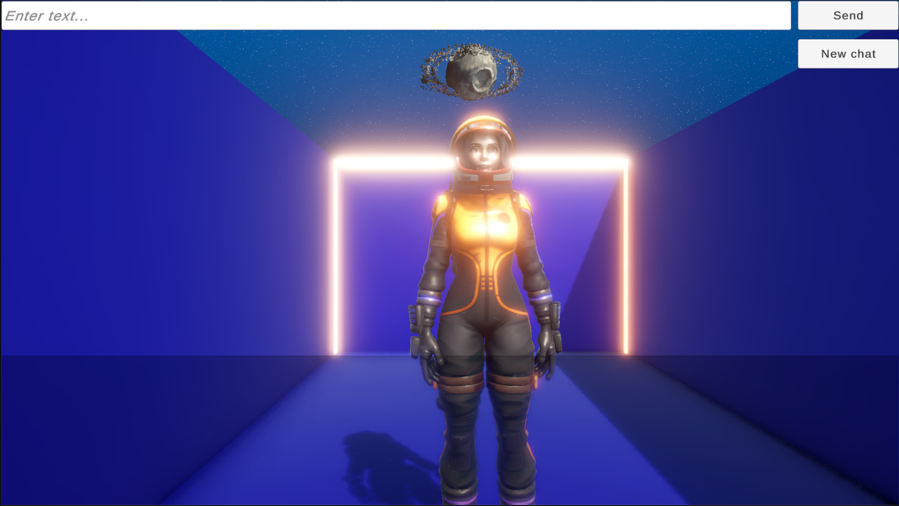
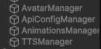
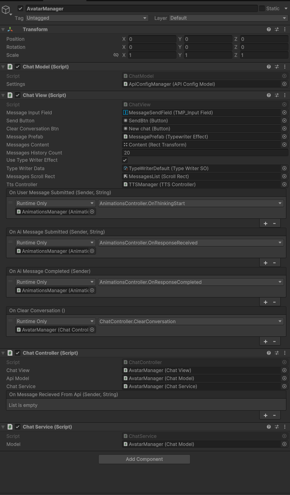
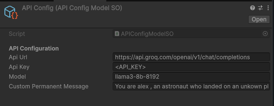
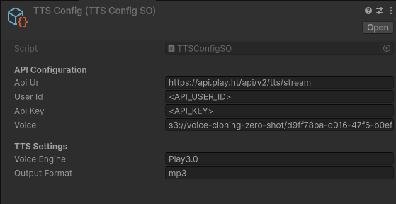
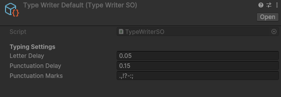
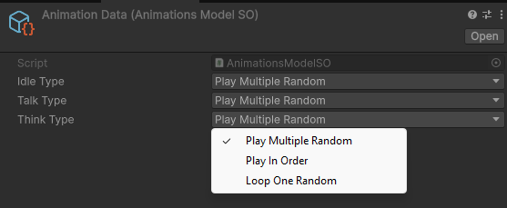

# MVC - Unity AI Avatar



A Unity project featuring an intelligent NPC avatar powered by LLM technology (via Groq API), complete with voice synthesis and dynamic animations. The project showcases an astronaut character in a space environment who can engage in meaningful conversations while maintaining context and performing realistic animations.

## 🚀 Features

- Interactive AI-powered conversations using Groq API
- Text-to-Speech synthesis using Play.ht
- Context-aware responses
- Dynamic character animations
- Typing animation effects
- Memory persistence with chat history
- MVC architecture for clean code organization
- Configurable components using ScriptableObjects


## 🛠 Prerequisites

- Unity (used version is Uity 6000.0.2f1)
- API keys for:
  - Groq API
  - Play.ht

## ⚙️ Architecture

The project follows the MVC (Model-View-Controller) pattern and is organized into the following components:

```

   ├── AvatarManager/
   │   ├── ChatModel
   │   ├── ChatView
   │   ├── ChatController
   │   └── ChatService
   ├── ApiConfigManager/
   │   └── ApiConfigModel
   ├── AnimationsManager/
   │   ├── AnimationsModel
   │   ├── AnimationsView
   │   └── AnimationsController
   └── TTSManager/
       ├── TTSModel
       ├── TTSView
       ├── TTSController
       └── TTSService
```






## 🎮 Configuration

### API Configuration
The project uses ScriptableObjects for easy configuration:

#### APIConfig
- API URL
- API Key
- Model
- Context (Avatar's role and personality)



#### TTSConfig
- API URL
- User ID
- API Key
- Voice Model
- Voice Engine
- Output Format



#### TypeWriterDefault
- Letter Delay
- Punctuation Delay
- Punctuation Marks



#### AnimationData
- Animation Selection Mode (Random/Sequence/Loop)
- Animation Clips Configuration



## 🎭 Avatar Personality

The avatar (Alex) is configured with the following background:
- An astronaut who discovered an unknown planet
- Pilots the spacecraft UPHF9000
- Intends to name the discovered planet "INSA"
- Specialized knowledge in space-related topics
- Maintains conversation context until reset

## 🎨 Animations

The avatar features multiple animation states:
- Idle (default state)
- Thinking (when processing user input)
- Talking (multiple variations during response)


## 💬 Conversation System

The chat system includes:
- Text input field for user messages
- Animated typing effect for responses
- Voice synthesis playback
- Chat history display
- New Chat button for context reset


## 🚀 Getting Started

1. Clone the repository
```bash
git clone https://github.com/yourusername/project-name.git
```

2. Open the project in Unity

3. Configure the ScriptableObjects:
   - Set up API keys in APIConfig
   - Configure TTS settings in TTSConfig
   - Adjust animation settings in AnimationData
   - Customize typing animation in TypeWriterDefault

4. Press Play in the Unity Editor to start interacting with the avatar
